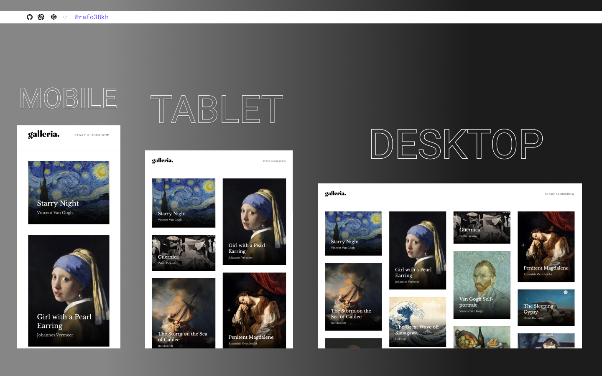

# Frontend Mentor - Galleria-Slideshow-Site Solution

This is a solution to the [Galleria-Slideshow-Site Challenge on Frontend Mentor]({https://www.frontendmentor.io/})

## Table of contents

- [Overview](#overview)
  - [The challenge](#the-challenge)
  - [Screenshot](#screenshot)
  - [Links](#links)
- [My process](#my-process)
  - [Built with](#built-with)
- [Author](#author)

## Overview

### The challenge

Your challenge is to build out this art gallery slideshow site and get it looking as close to the design as possible.

You can use any tools you like to help you complete the challenge. So if you've got something you'd like to practice, feel free to give it a go.

If you choose to use a JS-heavy approach, we provide a local `data.json` file for the paintings. This means you'll be able to pull the data from there instead of using the separate `.html` files.

Your users should be able to:

- View the optimal layout for the app depending on their device's screen size
- See hover states for all interactive elements on the page
- Navigate the slideshow and view each painting in a lightbox

### Screenshot

### Links

- Solution URL: [https://www.frontendmentor.io/challenges/galleria-slideshow-site-tEA4pwsa6](https://www.frontendmentor.io/challenges/galleria-slideshow-site-tEA4pwsa6)
- Live Site URL: [https://galleria-slideshow-site-azure.vercel.app/](https://galleria-slideshow-site-azure.vercel.app/)

## My process

### Built with

- NextJs
- Tailwind
- Mobile-first workflow

## Author

- Frontend Mentor - [@rafo38kh](https://www.frontendmentor.io/profile/rafo38kh)
- GitHub - [@rafo38kh](https://github.com/rafo38kh)
- Codewars - [@rafo38kh](https://www.codewars.com/users/rafo38kh)
